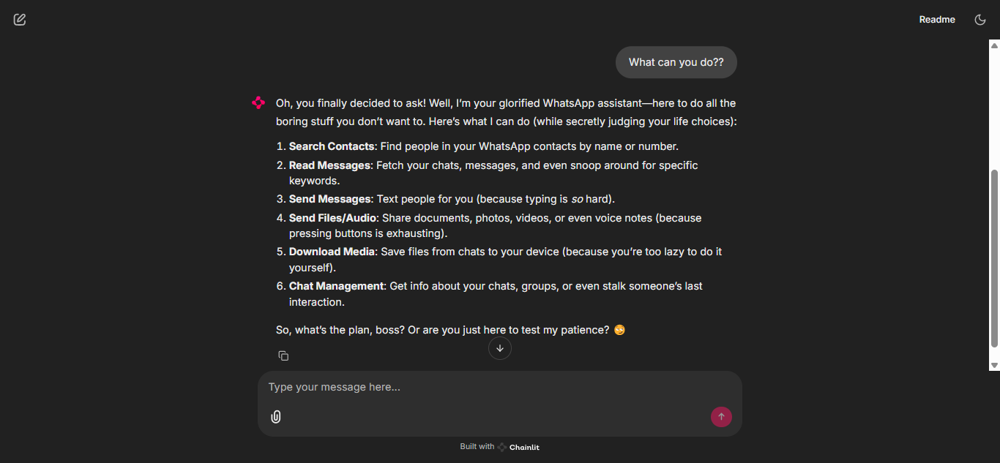

# WhatsApp Agent

An Agent that interacts with WhatsApp using WhatsApp MCP server. It can perform multiple actions on the user's behalf.



# 🚀 Features
The Agent is connected to WhatsApp MCP server. This server provides the following tools:

- **search_contacts:** Search for contacts by name or phone number
- **list_messages:** Retrieve messages with optional filters and context
- **list_chats:** List available chats with metadata
- **get_chat:** Get information about a specific chat
- **get_direct_chat_by_contact:** Find a direct chat with a specific contact
- **get_contact_chats:** List all chats involving a specific contact
- **get_last_interaction:** Get the most recent message with a contact
- **get_message_context:** Retrieve context around a specific message
- **send_message:** Send a WhatsApp message to a specified phone number or group JID
- **send_file:** Send a file (image, video, raw audio, document) to a specified recipient
- **send_audio_message:** Send an audio file as a WhatsApp voice message (requires the file to be an .ogg opus file or ffmpeg must be installed)
- **download_media:** Download media from a WhatsApp message and get the local file path

# ⚡Quick Start
## Prerequisites

*   Python 3.10+
*   WhatsApp MCP server
*   An OpenAI API key (or compatible service like DeepSeek)
*   [uv](https://github.com/astral-sh/uv)

> [!NOTE]
> To setup WhatsApp MCP server, follow the instructions in the [README](https://github.com/lharries/whatsapp-mcp).

## Installation

Follow these steps to set up the project on your local machine:

1. **Clone the repository**

    ```bash
    git clone https://github.com/aasherkamal216/whatsapp_agent.git
    cd whatsapp_agent
    ```

2. **Create and activate a virtual environment**

    ```bash
    uv venv
    # On macOS/Linux
    source .venv/bin/activate
    # On Windows
    .venv\Scripts\activate
    ```

3. **Install dependencies**

    ```bash
    uv sync
    ```

4. **Set up environment variables**

    Copy the example environment file and update it with your credentials:

    ```bash
    cp .env.example .env
    ```
    Add your environment variables to the `.env` file.

## Usage

Run the Chainlit app:
```bash
uv run chainlit run chainlit_app.py -w
```
The application will be running at `http://localhost:8000`

### Example Questions
Here are some example questions you can ask the WhatsApp Agent:

- Show me my recent chats.
- Send a message to John Doe: "Meeting at 5pm."
- List all messages from John in the last week.
- Download the last photo sent in the SF News group.
- Search for contacts named Alex.
- Get the last interaction with +1234567890.
